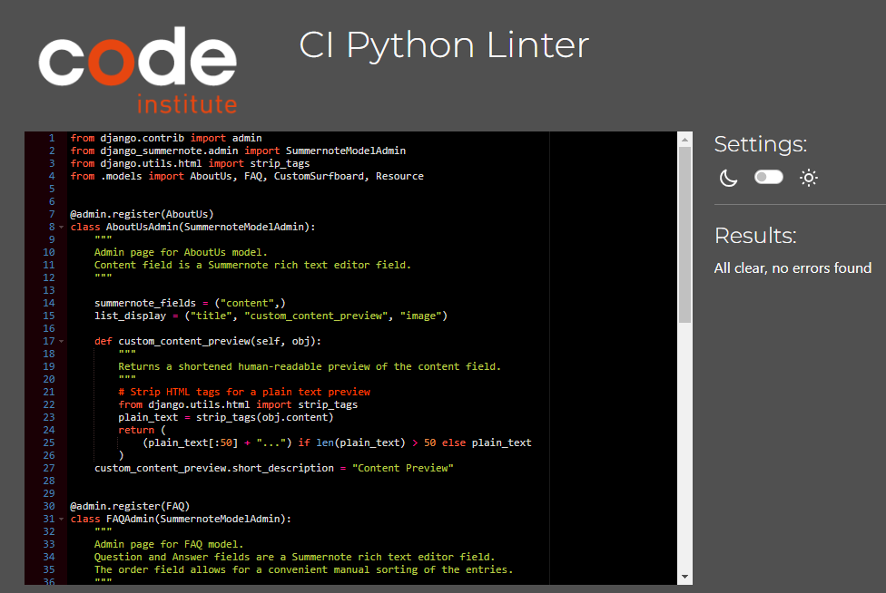
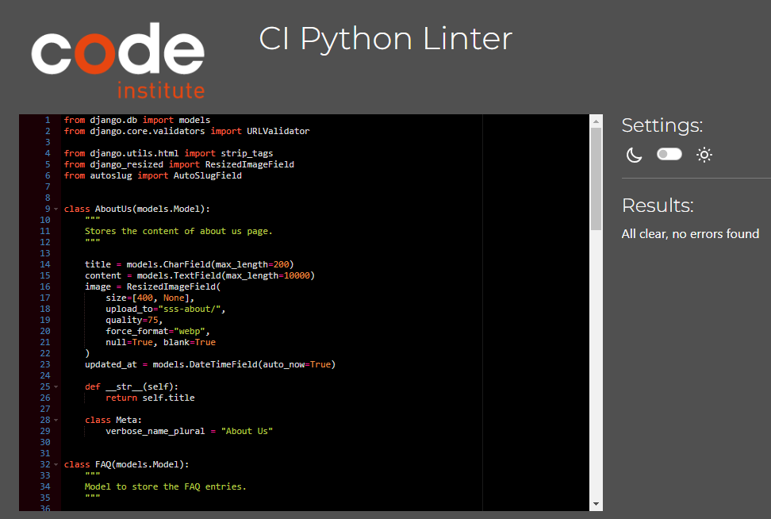
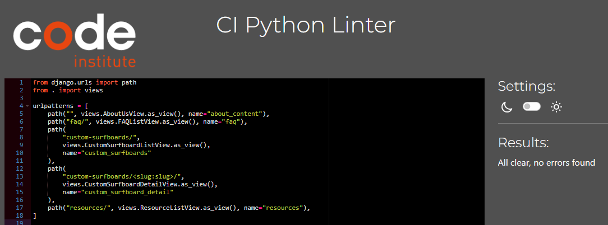
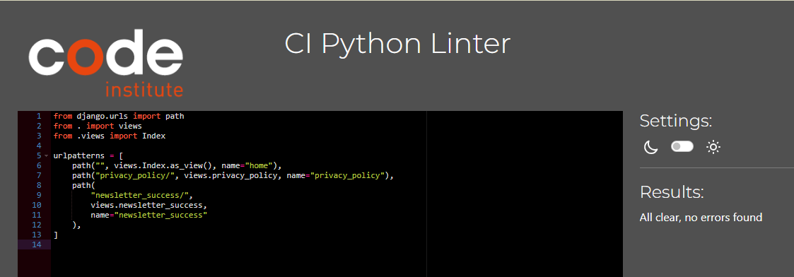
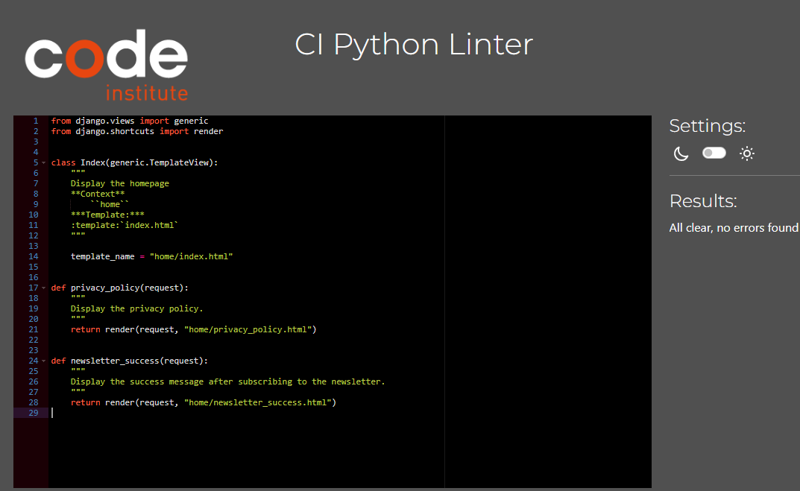
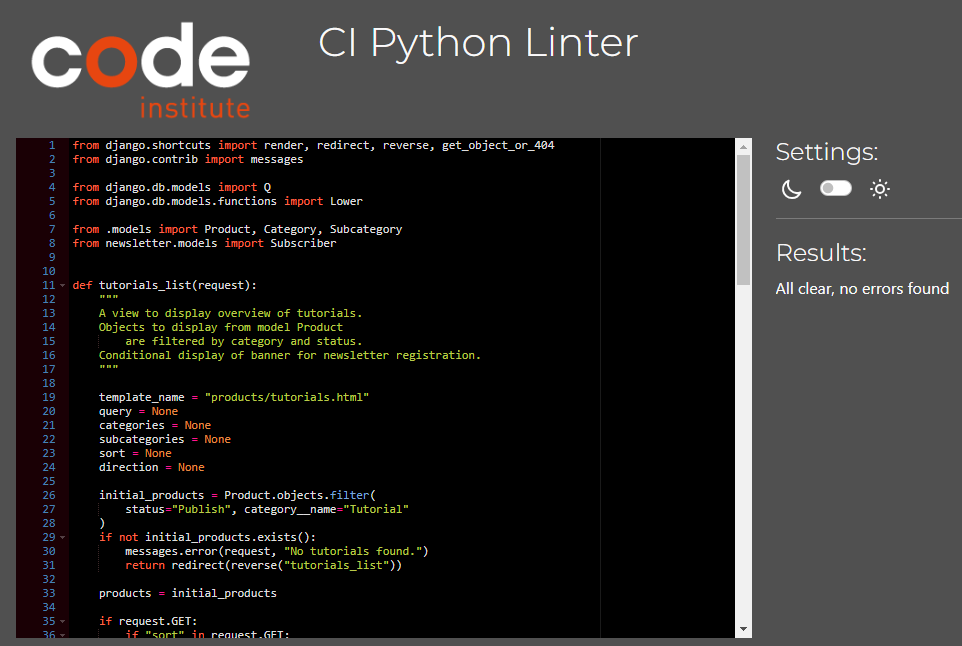
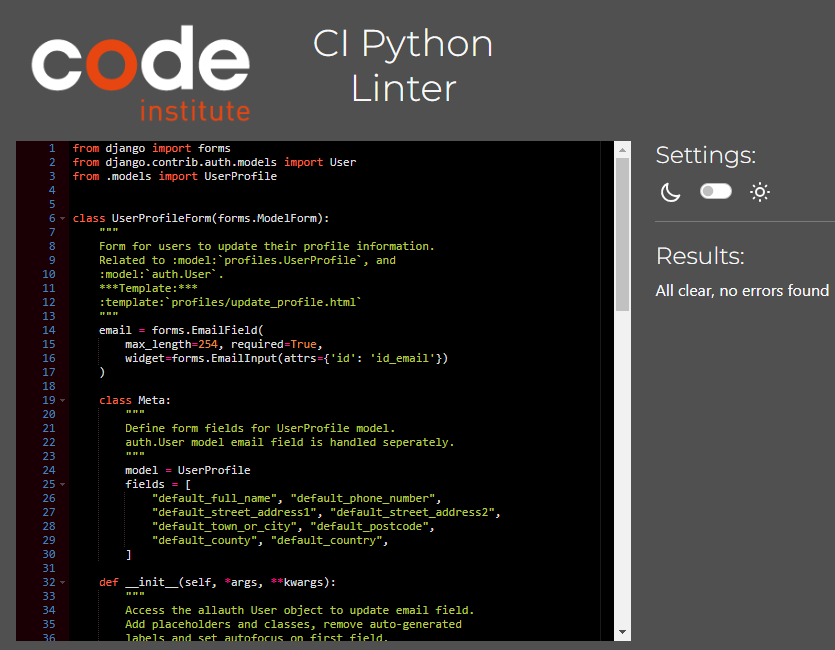
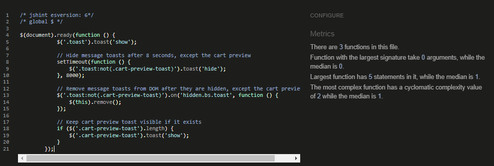
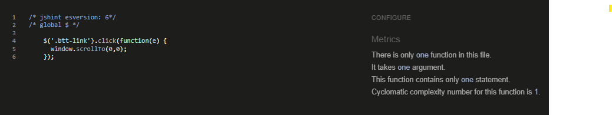
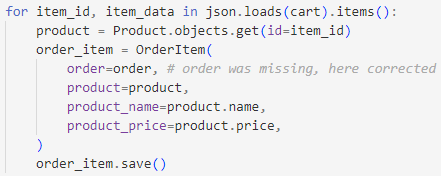

#  Testing Documentation for Shaping Sustainable Surf

This document outlines the testing procedures and results for the ecommerce project Shaping Sustainable Surf.

For development documentation, please refer to the [README.md](README.md).

View the live project [here]().<br>  
*(To open in a new window, press "Ctrl" + click on the link, or "⌘ + click" on Mac)*

## Overview

Thorough and continuous testing was performed throughout the development process to ensure:
- Seamless functionality of the code
- Adherence to official standards and guidelines
- Optimal user experience across various devices and browsers

## Table of Contents

[Automated Testing](#automated-testing)
[Manual Testing](#manual-testing)
[Security Testing](#security-testing)
[User Story Testing](#user-story-testing)
[Responsiveness Testing](#responsiveness-testing)
[Browser Compatibility](#browser-compatibility)
[Accessibility Testing](#accessibility-testing)
[Performance Testing](#performance-testing)
[Known Bugs](#known-bugs)
[Resolved Bugs](#resolved-bugs)
[Programs Used](#programs-used)

## Automated Testing

This section covers the automated tests performed on the project's code. It includes validation of Python, JavaScript, HTML, and CSS using industry-standard tools to ensure code quality and adherence to best practices.

### Python

[Python Linter Validator](https://pep8ci.herokuapp.com/) provided by the Code Institute according to the PEP 8 style guide was used for validating the Python code throughout the development process.<br>

The webhooks.py file raises two issue with the linter due to the line lenght exceeding the maximum line length of 79 characters. Strictly adhering to the guideline here causes issues in code performance and all orders are created in webhooks as a consequence. The issue raised by the linter is not considered a quality issue and is therefore ignored.<br>

| App      | File        | Screenshot                                                                                                                   | Result |
|----------|-------------|------------------------------------------------------------------------------------------------------------------------------|--------|
| checkout | webhooks.py | <details> <summary>**Click to View**</summary> </details> | noqa   |


The Django’s Allauth templates do not pass through the linter because Django templates have their own style requirements to ensure proper rendering and translation of the templates and do not follow the PEP 8 guidelines. Thus, these are not included in the linter validation.<br>

All other custom written Python code files passed through the Python Linter Validator according to the PEP 8 style without issues and passed all checks. This ensures the code adheres to PEP 8 guidelines.

| App                 | File               | Screenshot                                                                                                                                 | Result |
|---------------------|--------------------|--------------------------------------------------------------------------------------------------------------------------------------------|--------|
| about               | admin.py           | <details> <summary>**Click to View**</summary> </details>                           | Passed |
| about               | models.py          | <details> <summary>**Click to View**</summary> </details>                         | Passed |
| about               | urls.py            | <details> <summary>**Click to View**</summary> </details>                             | Passed |
| about               | views.py           | <details> <summary>**Click to View**</summary> </details>                           | Passed |
|                     |                    |                                                                                                                                            |        |
| cart                | admin.py           | <details> <summary>**Click to View**</summary> </details>                              | Passed |
| cart                | context.py         | <details> <summary>**Click to View**</summary> </details>                         | Passed |
| cart                | forms.py           | <details> <summary>**Click to View**</summary> </details>                             | Passed |
| cart                | models.py          | <details> <summary>**Click to View**</summary> </details>                           | Passed |
| cart                | urls.py            | <details> <summary>**Click to View**</summary> </details>                               | Passed |
| cart                | views.py           | <details> <summary>**Click to View**</summary> </details>                             | Passed |
|                     |                    |                                                                                                                                            |        |
| checkout            | admin.py           | <details> <summary>**Click to View**</summary> </details>                     | Passed |
| checkout            | forms.py           | <details> <summary>**Click to View**</summary> </details>                     | Passed |
| checkout            | models.py          | <details> <summary>**Click to View**</summary> </details>                   | Passed |
| checkout            | signals.py         | <details> <summary>**Click to View**</summary> </details>                 | Passed |
| checkout            | urls.py            | <details> <summary>**Click to View**</summary> </details>                       | Passed |
| checkout            | views.py           | <details> <summary>**Click to View**</summary> </details>                     | Passed |
| checkout            | webhook handler.py | <details> <summary>**Click to View**</summary> </details> | Passed |
|                     |                    |                                                                                                                                            |        |
| contact             | admin.py           | <details> <summary>**Click to View**</summary> </details>                       | Passed |
| contact             | forms.py           | <details> <summary>**Click to View**</summary> </details>                       | Passed |
| contact             | models.py          | <details> <summary>**Click to View**</summary> </details>                     | Passed |
| contact             | urls.py            | <details> <summary>**Click to View**</summary> </details>                         | Passed |
| contact             | views.py           | <details> <summary>**Click to View**</summary> </details>                       | Passed |
|                     |                    |                                                                                                                                            |        |
| home                | urls.py            | <details> <summary>**Click to View**</summary> </details>                               | Passed |
| home                | views.py           | <details> <summary>**Click to View**</summary> </details>                             | Passed |
|                     |                    |                                                                                                                                            |        |
| products            | admin.py           | <details> <summary>**Click to View**</summary> </details>                     | Passed |
| products            | forms.py           | <details> <summary>**Click to View**</summary> </details>                     | Passed |
| products            | models.py          | <details> <summary>**Click to View**</summary> </details>                   | Passed |
| products            | urls.py            | <details> <summary>**Click to View**</summary> </details>                       | Passed |
| products            | views.py           | <details> <summary>**Click to View**</summary> </details>                     | Passed |
|                     |                    |                                                                                                                                            |        |
| profiles            | forms.py           | <details> <summary>**Click to View**</summary> </details>                     | Passed |
| profiles            | models.py          | <details> <summary>**Click to View**</summary> </details>                   | Passed |
| profiles            | urls.py            | <details> <summary>**Click to View**</summary> </details>                       | Passed |
| profiles            | views.py           | <details> <summary>**Click to View**</summary> </details>                     | Passed |
|                     |                    |                                                                                                                                            |        |
| shaping-surf (core) | settings.py        | <details> <summary>**Click to View**</summary> </details>                                 | Passed |
| shaping-surf (core) | urls.py            | <details> <summary>**Click to View**</summary> </details>                                         | Passed |

### JavaScript 

The [JSHint Validator]( https://jshint.com/), a JavaScript Code Quality Tool was used to validate the JavaScript code. All custom written JavaScript code passed without errors through the validator.

| App      | Folder | File               | Screenshot                                                                                                       | Result |
|----------|--------|--------------------|------------------------------------------------------------------------------------------------------------------|--------|
| checkout | static | stripe_elements.js | <details> <summary>**Click to View**</summary> </details> | Passed |
| contact  | static | contact.js         | <details> <summary>**Click to View**</summary> </details>   | Passed |
| root dir | templates | base.html          | <details> <summary>**Click to View**</summary> </details>         | Passed |
| products | templates | tutorials.html     | <details> <summary>**Click to View**</summary> </details> | Passed |

### HTML

The [World Wide Web Consortium's Validation Service for Markup](https://validator.w3.org/) was used to check the HTML.

HTML code by URI input as well as loading the source code of each page from the browser by direct input into the validator. The HTML source code of the rendered website is used to validate code with Django template tags.

[Results to be added]

### CSS

The official [World Wide Web Consortium (W3C) validator for CSS](https://validator.w3.org/) was used to validate the CSS style sheet code.
[Results to be added]

## Manual Testing

Manual testing was conducted to verify the functionality, usability, and user experience of the website. This section details the test cases executed, the steps followed, and the results observed for each feature and user interaction.

### Test Cases

### Custom Error pages

To conveniently test the styling on the custom error pages during development, the following code was temporarily added to the app profile views and urls:

#### 404 Not Found

In `views.py`:

```python
def custom_404(request, exception):
    return render(request, '404.html', status=404)
```
In `urls.py`:

handler404 = 'profiles.views.custom_404'

To test: Navigate to any non-existent URL, e.g., /profile/test-404/

 <details>
<summary>Click for image 404 during development</summary>


</details>

#### 403 Forbidden

In `views.py`:
```python
from django.core.exceptions import PermissionDenied

def test_403(request):
    raise PermissionDenied
```
In `urls.py`:
path('test-403/', views.test_403, name='test_403'),

To test: Navigate to /profile/test-403/

 <details>
<summary>Click for image 403 during development</summary>


</details>

## Security Testing

This section focuses on security measures and testing.

### Security Considerations

As this is an educational project not intended for real-world deployment or to process actual payments, advanced security measures are beyond the current scope but would be essential in a production environment. 

**Stripe Integration**: 
- The project uses Stripe's test mode for simulating payments.
- All communications with Stripe API are done over HTTPS.

**Environment Variables**: Sensitive information like API keys are stored as environment variables to prevent exposure in the codebase.

**Error Handling**: Verified that error messages do not expose sensitive information.

**CSRF Protection**: Tested CSRF token implementation on all forms handling.

**Database Security**: The project utilizes Django's ORM for database operations, which provides built-in protection against SQL injection attacks.

**Authentication**: Authentication system, including password policies and session management, is handled by Django Allauth.

**Authorization**: Ensured proper access controls are in place, especially for product management, personal information, and payment-related functionalities.

## User Story Testing

Each user story defined in the project requirements was tested to ensure that the implemented features meet the needs and expectations of our target users. This section maps user stories to specific functionalities and describes how they were validated.
[Table to be added]

## Responsiveness Testing

The website's responsiveness across various devices and screen sizes was thoroughly tested. This section outlines the devices and screen resolutions used for testing and documents any adjustments made to ensure a consistent user experience across all platforms.
[Table to be added]

## Browser Compatibility

Testing was performed across multiple browsers to ensure cross-browser compatibility. This section lists the browsers tested, versions used, and any browser-specific issues encountered and resolved.
[Table to be added]

## Accessibility Testing

Accessibility testing was conducted to ensure the website is usable by people with various disabilities. This section covers the tools used for testing, such as screen readers and accessibility validators, and the improvements made based on the results.
[Results to be added]

### WAVE Web Accessibility Evaluation Tool
The [Wave WebAIM Validator](https://wave.webaim.org/) was used to validate web accessibility on the deployed website.
[Results to be added]

### Coolors contrast checker
[Coolors Color Contrast Checker]( https://coolors.co/contrast-checker/112a46-acc8e5) was used to validate color contrast for web accessibility in terms of readability.
[Results to be added]

## Performance Testing

Website performance was evaluated using the tool Google Lighthouse. This section presents the performance metrics, including load times, optimization opportunities, and the steps taken to enhance the site's speed and efficiency.

Lighthouse performance evaluation was performed on the deployed website using [Chrome Developer Tools Lighthouse Report](https://developer.chrome.com/docs/lighthouse/overview).
[Results to be added]

### Known Bugs
This section lists any known issues or limitations in the current version of the website. It includes descriptions of the bugs, their impact, and any planned resolutions or workarounds.
[Table to be added]

### Resolved Bugs
This section lists significant bugs that were encountered during development and testing, along with the solutions implemented. 


| Bug                                                                 | Description                                                                                                                                                                                           | Solution Applied                                                                                                                                                                                 | Result |
|---------------------------------------------------------------------|-------------------------------------------------------------------------------------------------------------------------------------------------------------------------------------------------------|--------------------------------------------------------------------------------------------------------------------------------------------------------------------------------------------------|--------|
| AttributeError: 'BlankChoiceIterator' object has no attribute 'len' | Error occurred when adding an order in the admin panel due to incompatibility with the CountryField choices processing.                                                                               | Upgrade Django CountryField package to the latest version.                                                                                                                                       | Solved |
| Unrecognized request URL                                            | Error encountered during order completion process.                                                                                                                                                    | Generated new Stripe API keys and properly set them in environment variables.                                                                                                                    | Solved |
| TypeError: Field 'id' expected a number but got ('2', 1)            | Checkout view raised an error due to incorrect data type for product ID.                                                                                                                              | change to item_id product = Product.objects.get(id=item_id) instead of product_id                                                                                                                | Solved |
| AttributeError: 'Order' object has no attribute 'update_total'      | Signal handlers in signals.py attempted to call a non-existent method on the Order model.                                                                                                             | Add update_total method to the Order model and call it explicitly in the checkout view.                                                                                                          | Solved |
| Order_total not displayed on checkout_success.html                  | Update_total method on Order model was calculating grand_total                                                                                                                                        | Add order_total to calculate grand_total.                                                                                                                                                        | Solved |
| Discount_amount not displayed on checkout_success.html              | Discount calculated in cart contexts.py is for temporary session-based calculations to display in shopping cart while the order model method is for permanent database-stored calculations.           | Add calculation for discount_code to update_total method on Order model.                                                                                                                         | Solved |
| Error in stripe webhook: full_name is not provided                 | Print statements show the full_name in terminal but stripe webhooks do not receive the information.                                                                                                   | Add order to OrderItem when creating an order in webhook_handler to correctly pass order details to stripe payment intent.                                                                       | Solved |
|                                                                     |                                                                                                                                                                                                       | <details> <summary>Click to View webhook error</summary> </details>                                                                   |        |
| checkout  views.py                                                  | All orders created in webhook.                                                                                                                                                                        | Fix indentation error in checkout view which prevented order to be created after validating the order form.                                                                                      | Solved |
| ContactForm                                                         | KeyError: user_profile not found in placeholders.                                                                                                                                                     | Add a placeholder for the user_profile field.                                                                                                                                                    | Solved |
| djrichtextfield and ckeditor                                        | Security issues due to djrichtextfield reported in admin panel with suggestion to swicth to ckeditor but After switching to ckeditor a new warning in the terminal that ckeditor has security issues. | Install Summernote to use SummernoteModelAdmin in admin interface and as suggested by Code Institute tutor support reinstall djrichtextfield since otherwise inconsistency with migration files. | Solved |
| Art model                                                           | Typo: self.get_art_display()                                                                                                                                                                          | self.get_type_display()                                                                                                                                                                          | Solved |
| wh_secret                                                           | wh_secret was set to development endpoint                                                                                                                                                             | create new endpoint for deployed website                                                                                                                                                         | Solved |
| Emails                                                              | Sending emails not working                                                                                                                                                                            | After changing the condition of debug settings in settings.py, the condition in email settings was not updated. Adjusted condition to same condition as debug condition.                         | Solved |
| Database                                                            | Issue in connecting to datase.                                                                                                                                                                        | Change database to Code Institute Database                                                                                                                                                       | Solved |
## Programs Used
A comprehensive list of all tools, validators, and programs used throughout the testing process and for this testing documentation. This section provides links and brief descriptions of each tool, helping readers understand the testing methodology and potentially replicate the tests.

-	[Python Linter Validator](https://pep8ci.herokuapp.com/) provided by the Code Institute according for Python code.
-	[World Wide Web Consortium's Validation Service for Markup](https://validator.w3.org/) for HTML code.
-	[World Wide Web Consortium (W3C) validator for CSS](https://validator.w3.org/) validator for the CSS stylesheet.
-	[JSHint Validator]( https://jshint.com/) for JavaScript scripts.
-	[Google Chrome Developer Tools Lighthouse](https://developer.chrome.com/docs/lighthouse/overview) for performance report.
-	[Wave WebAIM Validator](https://wave.webaim.org/) to validate web accessibility.
-	[Coolors Color Contract Checker]( https://coolors.co/contrast-checker/112a46-acc8e5) to assess contrast for accessibility.
-	[Table-magic](https://stevecat.net/table-magic/) to create markdown tables for this TESTING.md.
